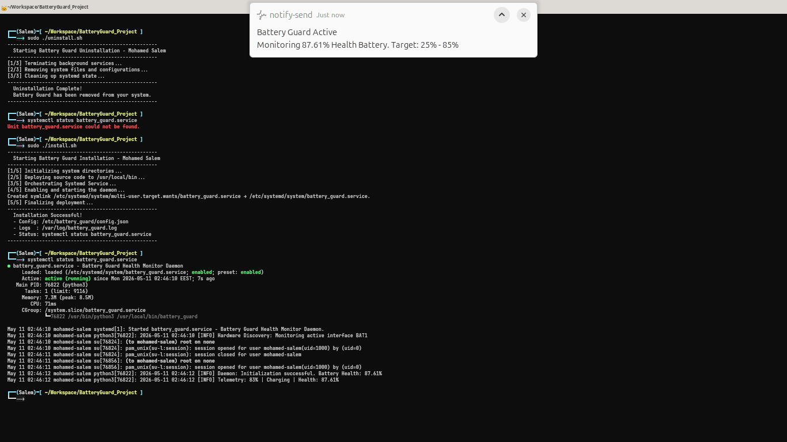

# 🔋 Battery Guard

**A Linux background daemon for battery health protection.**

> Written in Python · Runs as a Systemd service · Tested on Ubuntu Desktop

[](https://opensource.org/licenses/MIT)
[]()
[]()

---

## 📸 In Action


*Live desktop notification sent by the daemon when the battery reaches the configured threshold.*

---

## 💡 What is Battery Guard?

Lithium-ion batteries degrade faster when kept at 100% or drained to 0% repeatedly.
**Battery Guard** runs silently in the background and alerts you when to plug in or unplug — keeping your battery in the healthy zone (e.g., 25% – 85%).

It is built as a proper Linux system daemon using **Systemd**, not just a script.

---

## ✨ Features

- **Desktop Notifications** — Sends a popup alert when the battery hits the upper or lower limit
- **Audio Alert** — Plays a sound alongside the notification
- **Battery Health Tracking** — Calculates real wear level by comparing current capacity vs factory design capacity
- **Dynamic Polling** — Checks more frequently near thresholds, less frequently in safe zones (saves CPU)
- **Emergency Hibernation** — Optional: hibernates the system at a critical level (e.g., 5%) to prevent hardware damage
- **Hot-Reload Config** — Change thresholds in `config.json` without restarting the service
- **Rotating Logs** — Log file is capped at 1MB so it never fills your disk

---

## ⚠️ Requirements & Known Limitations

**This project is tested on Ubuntu Desktop with PulseAudio.**

| Requirement | Details |
|---|---|
| OS | Ubuntu 20.04 Desktop (recommended) |
| Audio system | PulseAudio *(PipeWire on Ubuntu 22.04+ may cause audio issues)* |
| Python | 3.8 or higher |
| User UID | Must be `1000` (first/primary user) |
| Hardware | Laptop with battery (won't work on desktops or WSL) |

**Dependencies:**
```bash
sudo apt install python3 libnotify-bin pulseaudio-utils
```

---

## ⚙️ Configuration

The config file lives at `/etc/battery_guard/config.json` after installation.

```json
{
    "MAX_BATTERY_LEVEL": 85,
    "MIN_BATTERY_LEVEL": 25,
    "EMERGENCY_LEVEL": 5,
    "SAFE_POLLING_SECONDS": 300,
    "CRITICAL_POLLING_SECONDS": 60,
    "DYNAMIC_POLLING": true,
    "HIBERNATE_ON_EMERGENCY": false,
    "AUDIO_ALERT_FILE": "/usr/share/sounds/freedesktop/stereo/complete.oga"
}
```

| Key | Default | Description |
|---|---|---|
| `MAX_BATTERY_LEVEL` | `85` | Alert when battery exceeds this while charging |
| `MIN_BATTERY_LEVEL` | `25` | Alert when battery drops below this while discharging |
| `EMERGENCY_LEVEL` | `5` | Critical threshold — triggers hibernation if enabled |
| `SAFE_POLLING_SECONDS` | `300` | Check interval (seconds) in the safe zone |
| `CRITICAL_POLLING_SECONDS` | `60` | Check interval (seconds) near thresholds |
| `DYNAMIC_POLLING` | `true` | Auto-adjust polling speed based on battery level |
| `HIBERNATE_ON_EMERGENCY` | `false` | Hibernate system at emergency level (use with caution) |
| `AUDIO_ALERT_FILE` | *(system sound)* | Path to `.oga` or `.wav` sound file for alerts |

Changes are applied automatically on the next check — no restart needed.

---

## 🚀 Installation

**1. Clone the repository:**
```bash
git clone https://github.com/Mohamed-Salem1/Linux-Battery-Guard.git
cd Linux-Battery-Guard
```

**2. Install dependencies:**
```bash
sudo apt install python3 libnotify-bin pulseaudio-utils
```

**3. Give execute permission:**
```bash
chmod +x install.sh uninstall.sh
```

**4. Run the installer:**
```bash
sudo ./install.sh
```

The installer will:
- Copy the daemon to `/usr/local/bin/`
- Create the config file at `/etc/battery_guard/config.json`
- Register and start a Systemd service automatically

---

## 📊 Usage

After installation, the service starts automatically on boot. You can monitor it with:

```bash
# Check if the service is running
systemctl status battery_guard.service

# Watch live logs
tail -f /var/log/battery_guard.log

# Restart after changing config
sudo systemctl restart battery_guard.service
```

---

## 📁 System File Layout

```
/usr/local/bin/battery_guard          ← The daemon engine
/etc/battery_guard/config.json        ← Your settings
/etc/systemd/system/battery_guard.service  ← Systemd unit
/var/log/battery_guard.log            ← Rotating log file
```

---

## 🗑️ Uninstallation

To remove everything cleanly:
```bash
sudo ./uninstall.sh
```

This stops the service, removes all files, and cleans up Systemd state.

---

## 🏗️ How It Works (Technical Overview)

```
Systemd (root)
    └── battery_guard (Python daemon)
            ├── Reads /sys/class/power_supply/BAT*/capacity
            ├── Reads /sys/class/power_supply/BAT*/status
            ├── Calculates wear level from energy_full / energy_full_design
            └── On threshold breach:
                    └── su - mohamed-salem -c "notify-send + paplay"
                              ↑
                    (Root-to-User bridge via su with explicit
                     DBUS + XDG + PULSE environment variables)
```

The daemon runs as `root` to access battery hardware, but notifications and audio must reach the **user's desktop session**. The bridge works by spawning the alert commands as the desktop user with the correct session environment variables injected.

---

## 📄 License

MIT License — see [LICENSE](LICENSE) for details.

---

*Built by [Mohamed Salem](https://github.com/Mohamed-Salem1) · May 2026*
